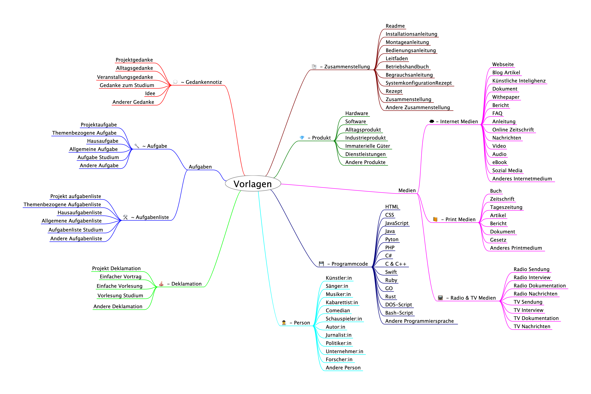

# Obsidian-Vorlagen für Wissenssammlung und Studium 
Das vorliegende Obsidian-Vorlagen bietet eine Zusammenstellung oft benötigter Notizarten zum Aufbau einer Wissensdatenbank.

## Obsidian
Die Software Obsidian erstellt und verwaltet Notizen im Markdown-Format. Sie eignet sich zur Verwaltung von einfachen Notizen bis zum umfangreichen Wissensmanagement und kann somit als Wissensdatenbank genutzt werden.
Mehr über [Obsidian](https://obsidian.md)

## Installation der Vorlagen
- Um die Vorlagen in Obsidian zur Verfügung zu stellen, kopiere die Vorlagen in den Obsidian-Vorlagenordner.
- Installiere die Erweiterung **"Templater"** von SilentVoid.
	- "Template folder location" muss den Pfad zum Vorlagenordner beinhalten.
- Installiere die Erweiterung **"Iconize"** von FlorianWoelki.
	- **"Icon identifier"** muss den Identifikator**`:`** beinhalten.
	- Folgende **"IconPacs"** müssen zur Anzeige der Icons installiert sein:
		- boxicons (Bo)
		- coolicons (Co)
		- font-awesome-solid (Fas)
		- octicons (Oc)
		- lucide-icons (Li) - Einstellung `Custom`
		- remix-icons (Ri)
		- rpg-awesome (Ra)
		- simple-icons (Si)
		- tabler-icons (Ti)

## Obsidian-Templates
Wird Obsidian als Wissensdatenbank genutzt, empfiehlt sich eine Notiz Struktur, was die bereitgestellten Templates als Ziel verfolgen. Die Vorlagen ermöglichen die Erstellung automatisierter themenbasierter Vorlagen, die bei der Initialisierung bereits wichtige Aspekte abfragen und direkt in die Notiz integrieren. Zusätzlich wird die Notiz individuell mit internen Links erweitert, was ein Wiederauffinden der Notiz erleichtert und die Visualisierung der Verbindungen in einem Diagramm ermöglicht.

### Notizstruktur
#### Name der Notiz
Beim Starten einer Notiz wird nach dem Namen der Notiz gefragt.
Jeder Notiztyp hat zur besseren Wiedererkennung eine eigenes Icon, gefolgt von einer Tilde `~` oder einem Bindestrich `-`. Die Tilde kennzeichnet befristete Notizen, der Bindestrich kennzeichnet Permanentnotizen. Nach der Kennzeichnung folgt der eingegebene Name der Notiz.

#### Metadaten
Jede Notiz beginnt mit den individuellen Metadaten, die je nach Auswahl der Notizeigenschaften abweichen.
**Die Metadaten beinhalten:**
- das Erstellungsdatum
- das Änderungsdatum (entspricht beim erstellen dem Erstellungsdatum und ist bei Änderungen manuell nachzuführen)
- der Alias Titel, sofern beim erstellen der Notiz einer eingegeben wird.
- die Tags, diese entsprechen dem Vorlagentyp und werden mit dem Status `aktiv` erweitert. (Beispiel: `declamation/aktiv`) Der Status sollte dem aktuellen Status angepasst werden.
- der Ausgewählte Notiz Typ
- dem Status der Dauerhaftigkeit (Dauerhaft, Befristet) Befristete Notizen sind Aufgaben, Aufgabenlisten, Gedankennotizen, Tagesnotizen.

#### Schlüsselinformationen der Notiz
Nach den Metadaten folgen die Schlüsselinformationen der jeweiligen Notiz in einer Tabelle. Diese werden anhand der zuvor gemachten Auswahl und den individuell getätigten Eingaben erstellt und können je nach Eingabe und Notiz Typ ziemlich umfangreich sein. Sie beinhalten aber mindestens die Art der Notiz und das Thema der Notiz.

#### Notizkörper
Nach nach den Metadaten und den Schlüsselinformationen folgt eine Querlinie `+++`. Der Nachfolgende Teil bis zur nächsten Trennlinie `+++` gibt nur einige Vorgaben zur jeweiligen Notiz und kann je nach Bedarf frei gestaltet werden.

#### Notizabschluss
Der Notiz Abschluss beinhaltet Abschnitte für  weitergehende Informationen, Erkenntnisse und Quellen. Dieser  Bereich sollte mit Informationen befüllt werden, die für die Notiz wichtig sind, aber nicht in direkten Zusammenhang mit der Notiz stehen. Dieser Bereich sollte, damit die Struktur der Notiz nicht beschädigt wird mit bedacht bearbeitet werden.

#### Notizen fürs Studium
Die Notizarten Deklamation, Aufgabe, Aufgabenliste und Gedankennotiz beinhalten eine Auswahl "Notiztyp-BSc". Dieser Notiztyp ist auf ein Studium ausgerichtet und kann bei Bedarf angepasst werden. 
**anzupassende Variablen / Konstanten*** (Achung, der beginnende Bereich notiztyp ist pro Notiztyp unterschiedlich)
- notiztypSubjectOptions -> gib deinem Studium einen Namen
- notiztypType -> übertrage den oben angegebenen Namen
- notiztypOrganization -> Schreibe die Organisation ein bei der du dein Studium machst
- notiztypCours -> Trage den Titel oder das erreichbare Ziel deines Studiums ein
- .notiztypSubjectOptions -> 

führe die Änderungen bei allen oben genannten vier Notiztypen durch

### Liste der Vorlagentypen
- Gedankennotiz
- Aufgaben
	- Einzelaufgabe
	- Aufgabenliste
- Deklamation
- Sitzungsprotokoll
- Medien
	- Internetmedien
	- Printmedien
	- Radio und TV Medien
- Person
- Zusammenstellung
- Programmcode
- Produkt

#### Vorlagen Untertypen
Die Notizen werden bei der Wahl der jeweiligen Vorlage weiter spezifiziert. 
Das folgende Mindmap bietet eine Übersicht der Untertypen.

#### Frei definierbare Werte
Jede Vorlage verfügt bei der Erstellung der Vorlage über frei definierbare Attribute. Die eingegebenen Attributwerte werden in der Schlüsselinformationstabelle der jeweiligen Notiz gespeichert. Werden wichtige Attributwerte nicht gesetzt, erscheint in der Schlüsselinformationstabelle das Attribut und der Wert "Keine Angabe". Wird bei weniger wichtigen Attributen keinen Wert zugewiesen, wird das Attribut in der Schlüsselinformationstabelle nicht aufgeführt.

## Allgemeines
- **License:** MIT License / Copyright (c) 2024 Cloubit GmbH
- **Sprache:** Deutsch
